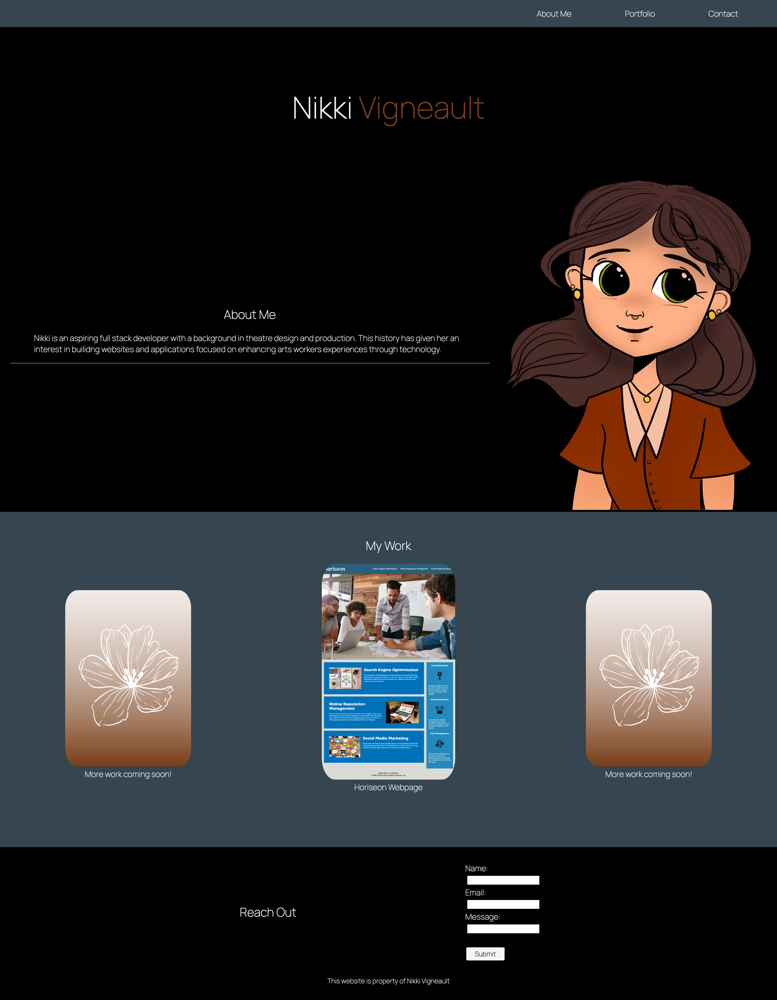

# My Portfolio

## Project Description

This website is used to introduce myself to future employers and colleagues by telling them abit about myself, show them some of my part work and allow them to get in contact with me through email. 

This website was made completely in Visual Studio Code with HTML and CSS.

```
Future Features:

- More expansive :hover options with the title appearing and image blurring once the mouse has scrolled over it
- Fully usable email contact form
- Clickable linked Logos to applicable accounts (ie. Github, LinkedIn, Professional Instagram)
```

## Webpage Image



## Deployed Link

https://nikkivno.github.io/My-Portfolio/

## License

MIT License


[](https://lbesson.mit-license.org/)
[](https://GitHub.com/Naereen/StrapDown.js/graphs/commit-activity)

